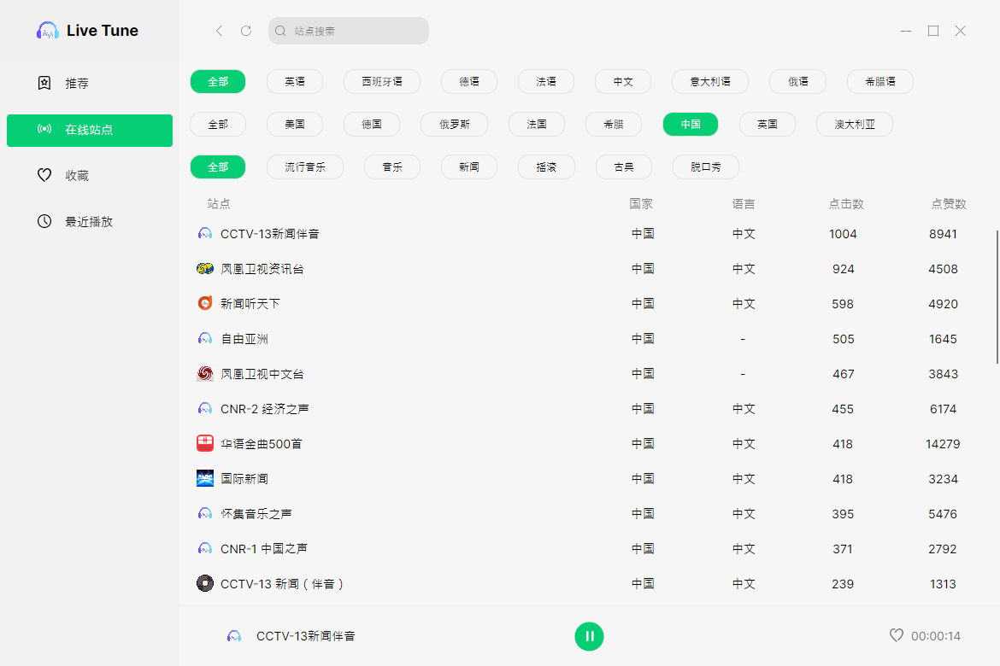

  

### LiveTune

LiveTune，基于Avalonia简单的网络电台播放器

- [RadioBrowser,提供网络电台数据](https://www.radio-browser.info/)
- [libvlcsharp,提供网络播放](https://github.com/videolan/libvlcsharp)
- [Avalonia](https://github.com/AvaloniaUI/Avalonia)
  
  
  
  
  
  
  
  
  
  
  
  

